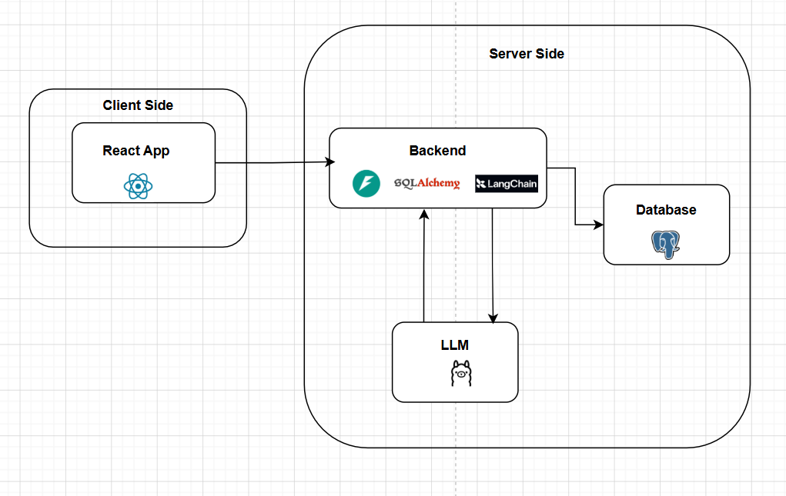

# Generative UI

**Transform Prompts into Production-Ready Form Layouts.**

Generative UI is a specialized FastAPI backend that leverages the power of LLMs to generate structured JSON layouts for forms from simple natural language descriptions.
---

## ✨ Key Features

- **Prompt-to-JSON**: Just describe your form in plain English.
- **Client-Ready**: Structured JSON output optimized for dynamic row-based rendering.
- **Intelligent Design**: Automatically selects appropriate input types (text, select, etc.) and validation rules.
- **FastAPI Powered**: High-performance
- **LLM Integration**: Built with LangChain and llama3.1.

---

## 🛠️ Tech Stack

- **Backend**: [FastAPI](https://fastapi.tiangolo.com/)
- **Orchestration**: [LangChain](https://www.langchain.com/)
- **Intelligence**: [llama3.1](https://ollama.com/) via groq
- **Environment**: Python 3.14
